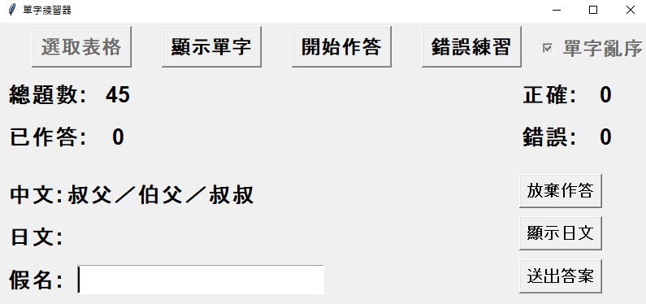

# 日文單字練習器

閒著的時候隨手寫的，功能挺陽春。單字是從[時雨の庭](https://www.sigure.tw/)抓的。

## 功能說明



- ```選取表格```: 讀取要練習的單字檔案
- ```顯示單字```: 顯示讀取完成的單字表
- ```開始作答```: 開始練習
- ```錯誤練習```: 練習結束後會顯示本次錯誤的單字，可以針對錯誤的單字再次練習
- ```單字亂序```: 勾選後，單字會以亂序出現，否則按照表格順序
- ```中文```: 題目區
- ```日文```: 作答區，可按```Enter```或```送出答案```確定答案並進入下一題
- ```顯示日文```: 按下後會顯示日文漢字，避免中文相同但漢字不同導致答錯，也可以按```Shift```
- ```放棄作答```: 按下後直接結束練習，且不進行結算
